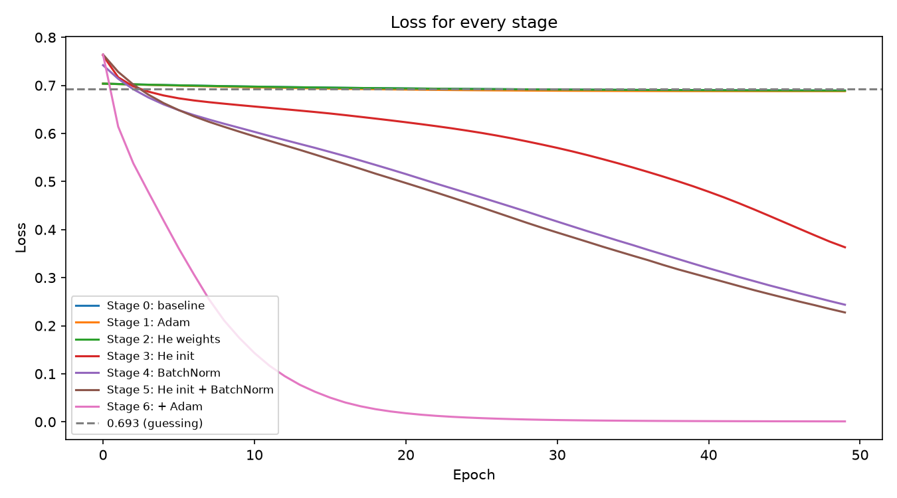

# Lab 02: Making Training Work

Finding out why a network would not train, then fixing it one change at a time.

## Setup

```bash
cd Lab-2
python3.12 -m venv .venv
source .venv/bin/activate   # Windows: .venv\Scripts\activate
pip install -r requirements.txt
```

## Run

From the `Lab-2` folder, with the virtual environment active:

```bash
python Lab2.py
```

This runs the baseline, the gradient check, every stage and the final comparison. It prints the gradients and final losses and saves every plot in `figures/`. Each plot also opens in a window, so close it to move on to the next stage. To run it without opening any windows:

```bash
MPLBACKEND=Agg python Lab2.py
```

The same code is in `Lab2.ipynb` with the outputs and observations for each stage. To use it, run `jupyter notebook Lab2.ipynb` and run all cells from top to bottom.

## Diagnosis

After one backward pass the mean gradient was exactly 0 in all 8 hidden layers. Every hidden layer has a bias of -2, which pushes almost all values below zero. The ReLU outputs 0 for these values and its gradient is also 0, so no gradient reaches the hidden layers. 93% of the ReLU outputs were zero in the first layer and 100% from layer 2 onwards. The failure is dead ReLUs caused by the initialization.

## Stages and results

| Stage | Change | Final loss |
|---|---|---|
| 0 (baseline) | BrokenNet, SGD lr=0.1 | 0.6893 |
| 1 (optimizer) | SGD to Adam | 0.6880 |
| 2 (initialization, weights) | He weight initialization | 0.6893 |
| 3 (initialization, bias) | He weights and bias -2 to 0 | 0.3632 |
| 4 (normalization) | BatchNorm before each ReLU | 0.2437 |
| 5 (both) | He initialization and BatchNorm | 0.2276 |
| 6 (optimizer) | Stage 5 trained with Adam | 0.0009 |



## Conclusion

BatchNorm mattered most. On its own it reached 0.2437, the best of any single change from the baseline. BatchNorm subtracts the average of each unit before the ReLU, which removes the -2 bias, so about half of the ReLUs become active and the gradient can flow again. Changing the optimizer did nothing while the gradient was zero (Stage 1) and only helped once the network was fixed (Stage 6).

## Known limitations

- Only one seed was used, so small differences like Stage 4 vs Stage 5 might change with another seed.
- The data has no test set, so only training loss is measured.
- Training is only 50 epochs, so the SGD stages were still improving when they stopped.
